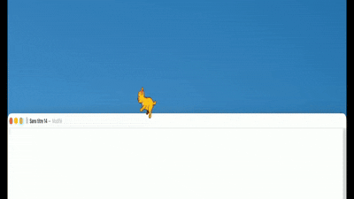
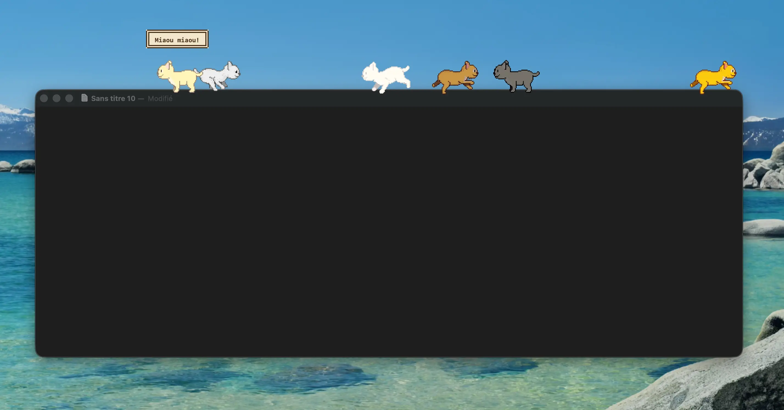
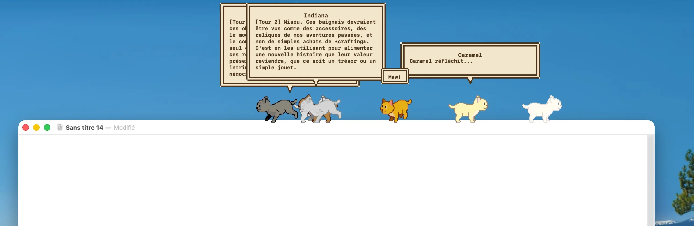

# CATAI

Virtual desktop pet cats for macOS — pixel art cats that live on your dock, chat with you via Ollama LLM, and debate ideas together to help you brainstorm and refine your thoughts.

  

<p align="center">
  
</p>


## Features

- **Dock companion** — Cats walk along your dock with pixel-perfect animations
- **Window perching** — When dock auto-hides, cats teleport to sit on top of your active window
- **Multi-cat** — Up to 7 cats with distinct colors and personalities
- **AI chat** — Click a cat to open a pixel-art chat bubble, powered by [Ollama](https://ollama.ai)
- **Cat Debate mode** — Your cats debate any topic together! Each cat argues from its personality, then they synthesize a final answer. A creative brainstorming & idea-refining tool
- **Mouse tracking** — Cats notice your cursor and turn to look at it. Get too close and they'll chase it!
- **Random meows** — Cats spontaneously say "Miaou~", "Prrr...", "Mrrp!" in cute speech bubbles
- **Pixel art UI** — Settings panel, chat bubbles, and controls all in retro pixel style
- **Menu bar icon** — 🐱 icon with quick access to settings and quit
- **Retina ready** — Nearest-neighbor scaling keeps pixel art crisp on HiDPI displays
- **Multilingual** — French, English, Spanish (switch with flag buttons)

## Cat Personalities

| Color | Default Name | Personality | Skill |
|-------|-------------|-------------|-------|
| 🟠 Orange | Citrouille | Playful & mischievous | Jokes & puns |
| ⚫ Black | Ombre | Mysterious & philosophical | Deep questions |
| ⚪ White | Neige | Elegant & poetic | Poetry & grace |
| 🔘 Grey | Einstein | Wise & scholarly | Science facts |
| 🟤 Brown | Indiana | Adventurous storyteller | Epic tales |
| 🟡 Cream | Caramel | Cuddly & comforting | Emotional support |
| 🐾 Percy | Percy | Retro geek & hilarious | 80s-90s internet references |


## Animations

Each cat has 368 hand-drawn sprites across 8 directions:

- **Walking / Chasing** — 8 frames per direction (all 8 directions!)
- **Eating** — 11 frames per direction
- **Drinking** — 8 frames per direction
- **Angry** — 9 frames per direction
- **Waking up** — 9 frames per direction
- **Idle / Looking / Sleeping** — Static rotation sprites (8 directions)

## Requirements

- macOS 14+ (Apple Silicon or Intel)
- [Ollama](https://ollama.ai) running locally (for chat feature, optional)

## Build & Run

### Download pre-built app

Grab `CATAI.zip` from [Releases](https://github.com/wil-pe/CATAI/releases), unzip, then:

```bash
xattr -cr CATAI.app   # remove macOS quarantine (app is unsigned)
open CATAI.app
```

### Build from source

```bash
./build.sh
open CATAI.app
```

### As standalone binary

```bash
swiftc -O -o cat cat.swift -framework AppKit -framework Foundation
./cat
```

No Xcode project, no dependencies, no package manager — just one Swift file.

## Settings

Click the 🐱 menu bar icon → Settings:

- **Language** — 🇫🇷 🇬🇧 🇪🇸 click a flag to switch
- **Cats** — Click a color bubble to add a cat, click × to remove
- **Name** — Rename each cat
- **Size** — Pixel art slider to scale cats
- **Ollama model** — Select from your installed models
- **Debate mode** — Toggle on/off to enable multi-cat brainstorming

## How It Works

- Single native Swift file (~2000 lines), no external dependencies
- `NSWindow` with transparent background for overlay rendering
- `CGWindowListCopyWindowInfo` for detecting frontmost windows
- Dock auto-hide detection via mouse position polling at 30 FPS
- Color tinting via direct pixel manipulation in sRGB `CGContext`
- Ollama streaming chat via `URLSessionDataDelegate`
- Conversation memory persisted in `UserDefaults`

  

## Project Structure

```
.
├── cat.swift              # Entire application (single file)
├── build.sh               # Build .app bundle script
└── cute_orange_cat/       # Sprite assets
    ├── metadata.json      # Animation & rotation definitions
    ├── rotations/         # 8 static direction sprites (68x68 PNG)
    └── animations/        # 5 animations × 8 directions × 8-11 frames
        ├── angry/
        ├── drinking/
        ├── eating/
        ├── running-8-frames/
        └── waking-getting-up/
```

## Changelog

### v2.0.2 — Debate UX overhaul: focused & non-intrusive (2026-04-16)
- **Focused debate** — cats now stay strictly on the user-supplied topic
  - System prompt rewritten as 6 strict rules: stay on topic, never derail, attempt creative tasks, personality is just *tone*, react to others, 2 short sentences
  - Each turn re-asserts the topic in the user message → no more drifting from "write a poem" to "what's a dinosaur"
  - Final synthesis now actually delivers the requested artefact (poem, plan, idea) instead of meta-summarising
- **Non-intrusive bubbles** — debate bubbles no longer steal focus from your work
  - New `passiveMode`: `ignoresMouseEvents = true`, `canBecomeKey = false`, no input field, no buttons
  - Uses `orderFrontRegardless` (display only) instead of `makeKeyAndOrderFront` + `NSApp.activate`
  - You can keep typing in your editor, switching apps, etc. — the debate just unfolds visually above your cats
- Clicks on cats are ignored during a debate (no accidental flow break)
- Bubbles auto-revert to interactive mode 8s after the synthesis appears




### v2.0.1 — Code quality pass: critical fixes & stability hardening (2026-04-16)
- **Debate engine** rewritten as a stateful class — eliminates Swift 6 Sendable warnings
  - Validates each cat still exists before its turn (survives mid-debate cat removal)
  - Generation counter invalidates stale callbacks if the debate is stopped
  - `DispatchQueue.main.asyncAfter` instead of `Timer.scheduledTimer` from URLSession queue
  - Public `stop()` called from `removeCat` and `applicationWillTerminate`
- **Debate button** now appears reliably (didSet observer triggers bubble rebuild)
- **OllamaChat** session race fixed — no more stale callbacks clearing newer requests
- **Memory** — `tintCache` bounded (`NSCache`, 600 items), `getPreview` cached, orphan `mem_<UUID>` purged at startup, `URLSession` properly invalidated
- **Robustness** — `fatalError` at startup → `NSAlert` with clear message, `addCat` rolls back on failure, `frontmostWindowFrame` cached (200 ms) to avoid hammering `CGWindowListCopyWindowInfo`
- **Code organisation** — `BehaviorTuning` enum centralizes AI tuning knobs, `Dictionary.localized()` helper dedupes the L10n fallback pattern
- Build is now clean: zero warnings, zero errors

### v2.0 — Cat Debate: brainstorm with your cats (2026-04-13)
- **Debate mode** — Your cats now debate any topic together in a dedicated window
  - Each cat argues from its unique personality (philosopher, geek, poet, scientist...)
  - 3 rounds of discussion where cats react to each other's arguments
  - Final synthesis/consensus by the moderator cat
  - Enable/disable via toggle in Settings
- **Debate button in chat bubble** — When debate mode is on, a "🎤 Débattre !" button appears in each cat's speech bubble
- **Non-streaming Ollama API** for reliable multi-turn debate exchanges
- **Fix:** Chat bubble input no longer loses focus when cat is walking
- CATAI is no longer just a desktop companion — it's now an **idea refinement system** powered by multiple AI personalities

### v1.3 — Percy the retro cat (2026-04-10)
- New 7th cat: **Percy** — white-grey cat with a unique personality
- Percy's dad is the "king of the internet" — he drops 80s-90s internet references (Astalavista, GeoCities, Netscape, IRC, BBS, AOL, 56k modems, ICQ...)
- Custom pixel-level desaturation tinting for Percy's white-grey look
- Custom bicolor bubble in the cat color picker
- Cat name displayed in chat bubble
- **Performance:** Sprite tint cache, conditional image updates, shared mouse polling, reduced dock polling

### v1.2 — Mouse tracking & code polish (2026-04-08)
- Cats now look toward your cursor when it's nearby (8 directions!)
- Cats chase the cursor when it gets close enough
- Sleeping cats wake up if you wave the cursor near them
- Centralized UI color palette for consistency
- Simplified Ollama model fetching
- Fixed angle mapping gap at 360 degrees
- Code optimizations (`hypot`, removed dead code)

### v1.1 — Bug fixes (2026-04-07)
- Fix cats floating after resize or dock refresh
- Fix chat bubble losing position near screen edge
- Remove force unwraps with safe fallbacks
- Fix potential crash in clamshell mode
- Fix memory leak on quit (monitors & timers)
- Fix fragile scale slider timer

### v1.0 — Initial release (2026-04-06)
- Multi-cat support with 6 color variants
- Distinct AI personalities per color
- Pixel art UI with custom controls
- Walk on dock and window title bars
- Random meow speech bubbles
- Chat memory persistence
- macOS .app bundle with build script

---

> *Multiplatform port in progress (Tauri v2) — Windows & Linux coming soon!* 🐱✨

## Thanks

A huge thank you to [Korben.info](https://korben.info) for the mention!

## License

MIT
